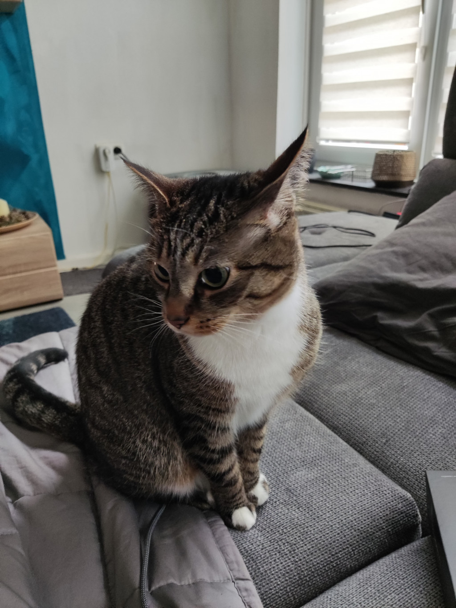

# markdown-to-html

THE Following shall be converted to html

# Jérôme Trips

*"The bad news is time flies. The good news is you're the pilot."*

 **Michael Altshuler**

## Passionate about Code and all things IT

| Birthday         | 26.11.1986  |
|------------------| ------------|
|Favorite color    | Red         |
|Favorite Food     | Pasta       |
|Pineaple on Pizza?| Hard No     |

### Hobbys

- Reading
- Boardgames
- Pen and Paper Roleplay
    - Pathfinder
    - Dungeons and Dragons 

#### You can always count on me when your linux breaks down

I see myself as a an ever extendingrepository of knowledge that everyone can querry. So feel free to ask me questions or help, i'd e happy to help out.

##### A funny story

A couple of years ago i came back from a party with a couple of friends;
The designated driver drove the tiniest fiat available and we were 10 people.
How to fit 10 people in a car that takes 5?
Here is a handy guide:
1. You stack 2 on  the passenger seat
2. You stack 6 on the back seat
3. Put one in the trunck with the beer
4. The driver takes his seat

Obviously I was the poor soul that went into the trunk.
By the time i got out i was hammered because, while curled up my keys poked holes into some of the beer cans and didnt want that to go to waste so i just tried to drink as much of it as possible.
